# Simple PNG Parser - Deflate format (Part 1)

In the previous post, I talked about a [Simple JSON Parser](https://marsp0.github.io/articles/simple-json-parser.html), in this one I'll talk about a simple PNG parser I wrote for a [software renderer](https://github.com/marsp0/pbr-software-renderer) I'm working on. I will split the post in two parts as it might get long. In the first part I'll talk about the deflate format and in the second I'll talk about the zlib format and the PNG format. The deflate format carries the actual image data and, as we will see, the PNG format is a wrapper around it.

I've split the post into four major sections, Huffman codes, Deflate format structure, Example parsing of a small stream, and implementation details.

## 1. Huffman codes

Huffman codes are used to compress data without losing any information and they are used extensively in the Deflate format. Compressed characters that are represented by less than 8 bits means that more than 1 compressed character can be placed in a byte. This also means that compressed characters can cross byte boundaries like in the example below.

```
   | A
   |
   |      | B
   |      |
   |      |     | C
 __|__ ___|_ ___|___
+---------+---------+
|11011 110|0 0110101|
+---------+---------+
  byte 1     byte 2
```
The characters `ABC` will usually take 24 bits(3 bytes) but only 2 bytes when compressed. The compressed representation of the characters are called Huffman codes (So `11011` is the Huffman code for `A` and `1100` is the code for `B`). Huffman codes depend on the input buffer they are generated for, so different buffers will have different codes for the same character.

### 1.1 Code generation

Huffman coding is a method that can generate these codes. It takes in an input buffer, it looks at the frequency with which each character appears in the buffer and it generates a set of codes with variable lengths. Characters that appear more often in the input buffer will have shorter codes in terms of bits. One additional property is that shorter codes will not appear as prefixes in longer codes (`01` and `011` cannot be generated for the same buffer). This means that when the data is being decompressed there will be no ambiguity about what character the codes represent.

This set codes is also known as a Huffman tree because it is represented by a binary tree. The leaf nodes in the binary tree are the characters from the input buffer. The intermediate nodes hold the value of **zero** or **one**. By concatenating the zeros and ones along the path from the root to each leaf node we get the Huffman code for that node.

Let's look at an example by generating the Huffman codes for the buffer `ABCABADDBAT` using the algorithm described below.

```plaintext
1. Create a leaf node for each symbol and add it to the priority queue.
2. While there is more than one node in the queue:
    2.1 Remove the two nodes of highest priority (lowest probability) from the queue
    2.2 Create a new internal node with these two nodes as children and with probability equal to the sum of the two nodes' probabilities. Left node is labeled 0 and right node is labeled 1
    2.3 Add the new node to the queue.
3. The remaining node is the root node and the tree is complete.
```
The number in each node is its frequency.

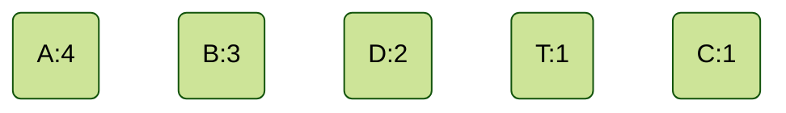
```mermaid
%%{init: { 'theme':'forest' } }%%
graph
    A(A:4)
    B(B:3)
    D(D:2)
    T(T:1)
    C(C:1)
```

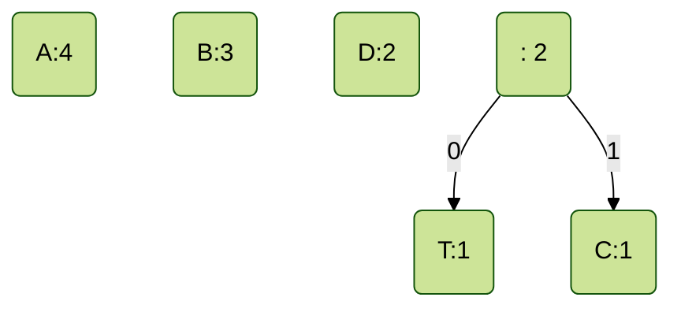
```mermaid
%%{init: { 'theme':'forest' } }%%
graph
    A(A:4)
    B(B:3)
    D(D:2)
    T(T:1)
    C(C:1)
    TC( : 2)
    TC --> |0|T
    TC --> |1|C

```

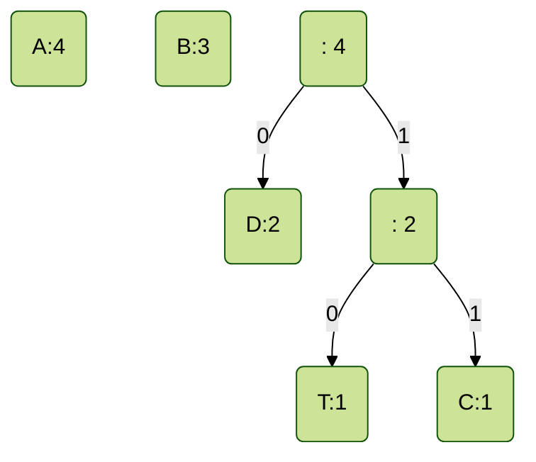
```mermaid
%%{init: { 'theme':'forest' } }%%
graph
    A(A:4)
    B(B:3)
    D(D:2)
    T(T:1)
    C(C:1)
    TC( : 2)
    TC --> |0|T
    TC --> |1|C
    DTC( : 4)
    DTC --> |0|D
    DTC --> |1|TC
```

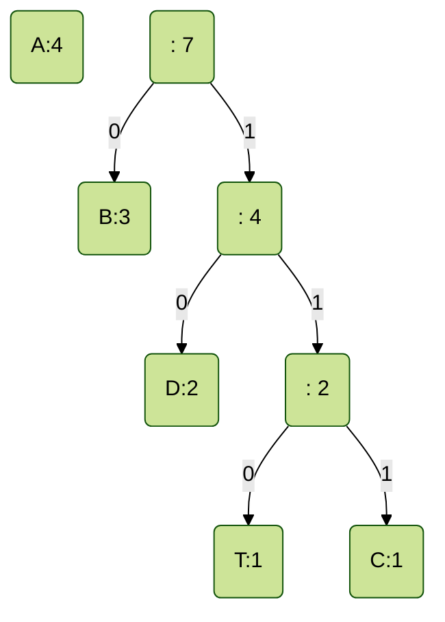
```mermaid
%%{init: { 'theme':'forest' } }%%
graph
    A(A:4)
    B(B:3)
    D(D:2)
    T(T:1)
    C(C:1)
    TC( : 2)
    TC --> |0|T
    TC --> |1|C
    DTC( : 4)
    DTC --> |0|D
    DTC --> |1|TC
    BDTC( : 7)
    BDTC --> |0|B
    BDTC --> |1|DTC
```

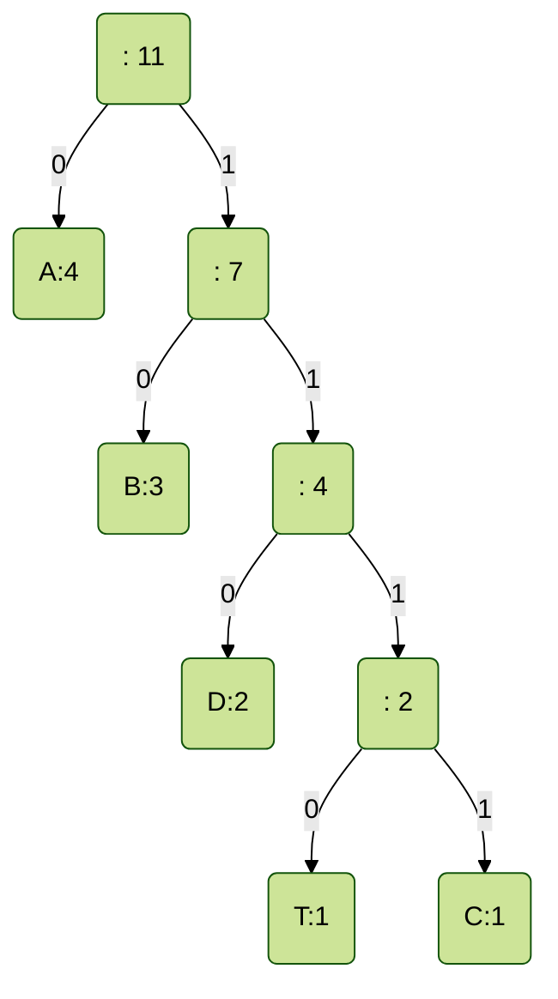
```mermaid
%%{init: { 'theme':'forest' } }%%
graph
    A(A:4)
    B(B:3)
    D(D:2)
    T(T:1)
    C(C:1)
    TC( : 2)
    TC --> |0|T
    TC --> |1|C
    DTC( : 4)
    DTC --> |0|D
    DTC --> |1|TC
    BDTC( : 7)
    BDTC --> |0|B
    BDTC --> |1|DTC
    ABDTC( : 11)
    ABDTC --> |0|A
    ABDTC --> |1|BDTC
```
With the tree above we have reduced the bits needed to represent each character in the buffer. As I mentioned previously, the encoding is valid only for this buffer. A different buffer will have different Huffman codes.

| ASCII | Binary (raw) | Binary (compressed)
|- | - | - |
| `A` | `01000001` | `0`|
| `B` | `01000010` | `10`|
| `D` | `01000100` | `110`|
| `T` | `01010100` | `1110`|
| `C` | `01000011` | `1111`|

### 1.2 Code usage

Now that we have the Huffman tree we can iterate over the input buffer and replace the characters with their encoded representation. The output buffer will have less bits than the input buffer.

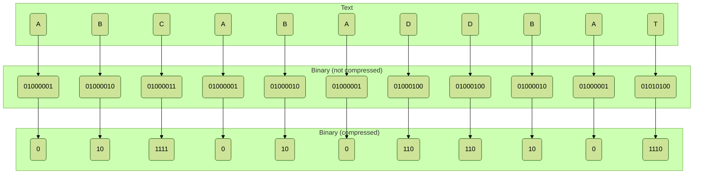
```mermaid
%%{init: { 'theme':'forest' } }%%
graph
    subgraph "Text"
        A(A)
        B(B)
        C(C)
        D(A)
        E(B)
        F(A)
        H(D)
        I(D)
        K(B)
        L(A)
        M(T)
    end
    subgraph "Binary (not compressed)"
        a(01000001)
        b(01000010)
        c(01000011)
        d(01000001)
        e(01000010)
        f(01000001)
        h(01000100)
        i(01000100)
        k(01000010)
        l(01000001)
        m(01010100)
        A --> a
        B --> b
        C --> c
        D --> d
        E --> e
        F --> f
        H --> h
        I --> i
        K --> k
        L --> l
        M --> m
    end
    subgraph "Binary (compressed)"
        aa(0)
        bb(10)
        cc(1111)
        dd(0)
        ee(10)
        ff(0)
        hh(110)
        ii(110)
        kk(10)
        ll(0)
        mm(1110)
        a --> aa
        b --> bb
        c --> cc
        d --> dd
        e --> ee
        f --> ff
        h --> hh
        i --> ii
        k --> kk
        l --> ll
        m --> mm
    end
```

As you can see we went from 88 bits (11 bytes) to 26 bits (4 bytes with rounding). This is quite the decrease in space but there is one problem. If we transmit this data, how would the receiver know how to decompress it? In the Deflate format the Huffman tree is sent together with the data. When compressing big chunks the overhead of sending the tree becomes zero.

### 1.3 Additional rules for Deflate format

To adapt the code generation to the deflate format two additional rules are needed

- Shorter codes lexicographically precede longer codes.
    - `1` and `01` are invalid, but `0` and `10` are valid.

- All codes of a given bit length have lexicographically consecutive values, in the same order as the symbols they represent.
    - If the first code of length 4 is `1000` then the next code the same length has to be `1001`.

## 2. Deflate format

Deflate streams consist of a series of blocks. Each block has a 3bit header and a payload. Our goal is to iterate over the blocks, decode them and generate some output buffer of decompressed data.

To make things easier to understand we'll parse an example buffer as we go through the sections. The full hex buffer is

`1d c6 49 01 00 00 10 40 c0 ac a3 7f 88 3d 3c 20 2a 97 9d 37 5e 1d 0c`

Below is a mapping between the hex and binary representation of the buffer.

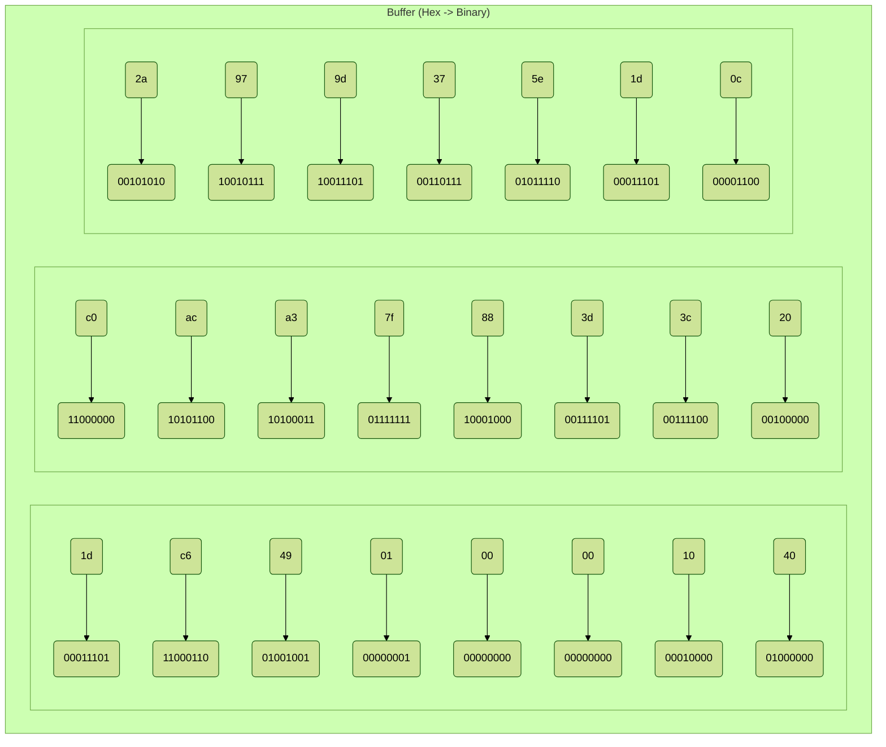
```mermaid
%%{init: { 'theme':'forest' } }%%
graph
    subgraph "Buffer (Hex -> Binary)"
        direction RL
        subgraph " "
            direction TB
            A(1d)
            B(c6)
            C(49)
            D(01)
            E(00)
            F(00)
            G(10)
            H(40)
            AB(00011101)
            BB(11000110)
            CB(01001001)
            DB(00000001)
            EB(00000000)
            FB(00000000)
            GB(00010000)
            HB(01000000)
            A --> AB
            B --> BB
            C --> CB
            D --> DB
            E --> EB
            F --> FB
            G --> GB
            H --> HB
        end
        subgraph " "
            direction TB
            I(c0)
            J(ac)
            K(a3)
            L(7f)
            M(88)
            N(3d)
            O(3c)
            P(20)
            IB(11000000)
            JB(10101100)
            KB(10100011)
            LB(01111111)
            MB(10001000)
            NB(00111101)
            OB(00111100)
            PB(00100000)
            I --> IB
            J --> JB
            K --> KB
            L --> LB
            M --> MB
            N --> NB
            O --> OB
            P --> PB
        end
        subgraph " "
            direction TB
            Q(2a)
            R(97)
            S(9d)
            T(37)
            U(5e)
            V(1d)
            W(0c)
            QB(00101010)
            RB(10010111)
            SB(10011101)
            TB(00110111)
            UB(01011110)
            VB(00011101)
            WB(00001100)
            Q --> QB
            R --> RB
            S --> SB
            T --> TB
            U --> UB
            V --> VB
            W --> WB
        end
    end
```


### 2.1 Bit as a unit

Before we continue the discussion I want to touch on something that will be important. As you have noticed, I've talked more about bits than bytes. In the deflate stream bits are the most basic unit, the stream itself is looked at as a bitstream rather than a bytestream. Computers store information in bytes so this is something we have to keep in mind when extracting data from the stream, but from Deflate's point of view, this is just an implementation detail. An example below

```
 ________byte 1_________ ________byte 2_________
+-----------------------+-----------------------+
|08 07 06 05 04 03 02 01|16 15 14 13 12 11 10 09|
+-----------------------+-----------------------+
```
Looking at the bytes above, it would be completely normal to parse and interpret bits `08 09 10 11` as a Huffman code.

Another thing that should be kept in mind is that numbers should be parsed starting with the least significant bit (there is one exception i'll come back to) while Huffman codes should be parsed with the most significant bit first.

### 2.2 Header

The header has 3 bits, the first bit indicates if this is the last block in the stream. The other 2 bits indicate the type of compression scheme.

- `00` - no compression
- `01` - compressed with fixed Huffman codes
- `10` - compressed with dynamic Huffman codes
- `11` - reserved (error)

Something to note is that the block (and so the header) do not have to necessarily start on a byte boundary. The header can start on any bit in the bitstream.

I'll only talk about the dynamic Huffman codes as this is the only compression scheme my parser supports. All of the textures I've looked at use that type so it seems to be enough.

#### 2.2.1 Example buffer - parsing header

In our buffer the header starts on a byte boundary as this is the first block.

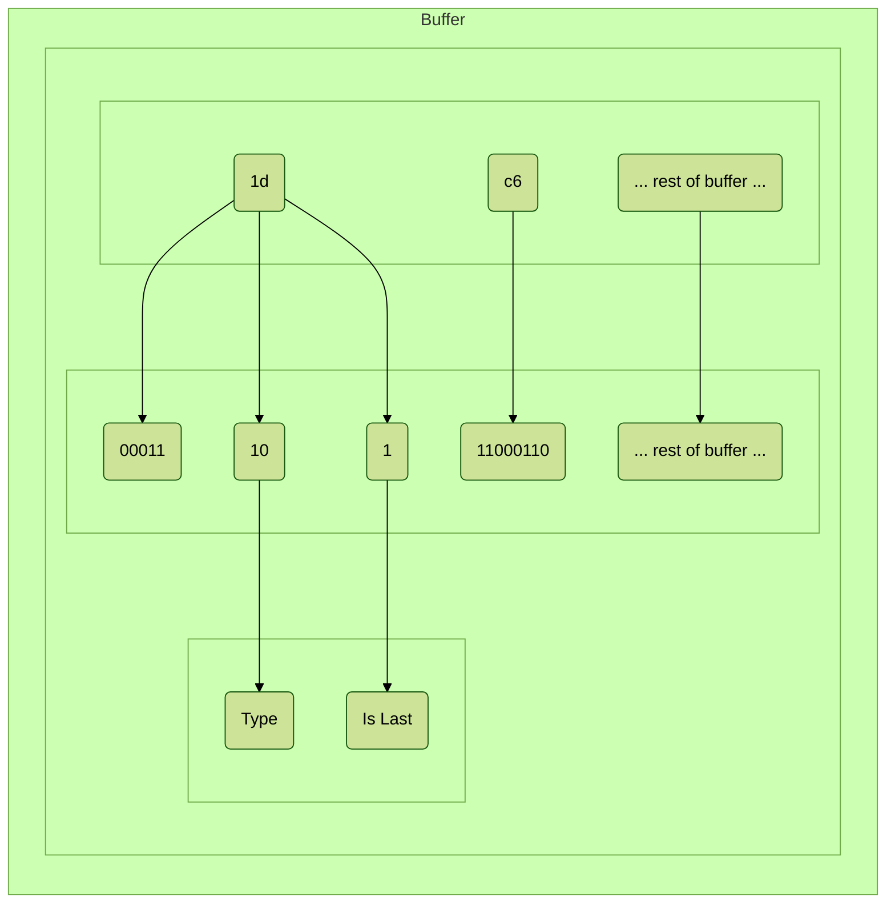
```mermaid
%%{init: { 'theme':'forest' } }%%
graph
    subgraph "Buffer"
    direction TB
        subgraph " "
            direction TB
            subgraph " "
                A(1d)
                B(c6)
                C("... rest of buffer ...")
            end
            subgraph " "
                AB(00011)
                ABA(10)
                ABAA(1)
                BB(11000110)
                CB("... rest of buffer ...")
            end
            subgraph " "
                T("Type")
                L("Is Last")
            end
           
            A --> AB
            A --> ABA
            A --> ABAA
            B --> BB
            C --> CB
            ABA --> T
            ABAA --> L
        end        
    end
```

**Remember that we are consuming bytes left to right (-->) and bits right to left (<--).**

We can see that this is the last block, and that the compression uses dynamic Huffman codes. The type is parsed starting with the least significant bit (on the right).


### 2.3 Dynamic Huffman blocks

In the context of Deflate blocks, I will refer to Huffman trees as alphabets to match the language used in the RFC.

The block starts with three alphabets followed by the compressed stream. The stream contains bits that encode either literal bytes or <length:distance> pairs. The distance indicates how far back we should go in the output buffer, the length indicates how many bytes to copy from there.

The pseudocode for the decoding algorithm are below
```
do
    read block header from input stream.
    assert that compression scheme uses dynamic Huffman codes
    read representation of alphabets (more on this in a second)
   
    loop (until end of block code recognized)
        decode literal/length value from input stream
        if value is literal
            copy value (literal byte) to output stream
       
        otherwise
            if value = end of block
                break from loop
            otherwise (value is a length)
                decode distance from input stream
               
                move backwards distance bytes in the output stream, and copy length bytes from this position to the stream.
         
    end loop
   
while not last block
```

That is a lot of information so lets go through it step by step starting with the alphabets.

#### 2.3.1 Alphabets

We'll first look at how the alphabets are used and then at how we can parse them.

We use one of the alphabets to decode the literal bytes and the lengths. We use a second alphabet for the distances. The reason to have both lengths and literal bytes in the same alphabet is so that we do not have to wonder what the current bits encode. Having them in the same alphabet ensures that their codes will be unique. The reason the distance is not included is because we know that it can appear only after a length. Basically, if we see a length value, then the next bits we parse we have to look up in the distance alphabet.

Since the two alphabets are encoded to further save space, a third alphabet is needed to decode them. I'll go over the first two and then I'll come back to this one.

#### - Literal/Length Alphabet (LL)

When we start parsing the buffer we can encounter three possibilities:

- Huffman code that encodes a value between 0 and 255. In this case we simply output the the value itself to the output buffer.
- Huffman code that encodes the value 256. This value indicates end of block.
- Huffman code that encodes a value between 257 and 285. These values represent lengths and there are some rules associated with each of them. Ive included the table with rules below. The first column is the decoded value, the third column represents the length. As you can see some of the entries in the third column have a range, so we use the second column to narrow down the range to a single value. We need to parse the extra bits starting with the most significant bit first (this is the exception I was talking about before). So the length for value `273` will be `35` + 3 bit int (MSB order).

```
        Extra               Extra               Extra
   Val  Bits Length(s)  Val  Bits Lengths   Val  Bits Length(s)
   ---- ---- ------     ---- ---- -------   ---- ---- -------
    257   0     3       267   1   15,16     277   4   67-82
    258   0     4       268   1   17,18     278   4   83-98
    259   0     5       269   2   19-22     279   4   99-114
    260   0     6       270   2   23-26     280   4  115-130
    261   0     7       271   2   27-30     281   5  131-162
    262   0     8       272   2   31-34     282   5  163-194
    263   0     9       273   3   35-42     283   5  195-226
    264   0    10       274   3   43-50     284   5  227-257
    265   1  11,12      275   3   51-58     285   0    258
    266   1  13,14      276   3   59-66
```

#### - Distance alphabet (D)

This alphabet uses the same scheme as the Huffman codes for the lengths. There are 32 values in total but the last two are not currently used so they are not included in the table. I am not sure what their purpose is but it could be values reserved for future expansion.

```
         Extra           Extra               Extra
    Val  Bits Dist  Val  Bits   Dist     Val Bits Distance
    ---- ---- ----  ---- ----  ------    ---- ---- --------
      0   0    1     10   4     33-48    20    9   1025-1536
      1   0    2     11   4     49-64    21    9   1537-2048
      2   0    3     12   5     65-96    22   10   2049-3072
      3   0    4     13   5     97-128   23   10   3073-4096
      4   1   5,6    14   6    129-192   24   11   4097-6144
      5   1   7,8    15   6    193-256   25   11   6145-8192
      6   2   9-12   16   7    257-384   26   12  8193-12288
      7   2  13-16   17   7    385-512   27   12 12289-16384
      8   3  17-24   18   8    513-768   28   13 16385-24576
      9   3  25-32   19   8   769-1024   29   13 24577-32768
```

Example: the distance for value `17` will be equal to `385` + 7 bit integer (MSB order).

#### - Code Length Alphabet (CL)

Since we know the values of the alphabets (LL: 0-285 ; D: 0-31) from the RFC we do not need to store them in the deflate stream. We could just store the lengths of the codes representing each value. For example, the LL alphabet would be represented by 286 lengths. The *ith* length shows how long the Huffman code for *i* is.

The CL alphabet has 19 values (0-18) as per the below table:

```
      0 - 15: Represent code lengths of 0 - 15
          16: Copy the previous code length 3 - 6 times.
              The next 2 bits indicate repeat length
                    (0 = 3, ... , 3 = 6)
                 Example:  Values `8, 16 (+2 bits 11), 16 (+2 bits 10)` will expand to 12 code lengths of 8 (1 + 6 + 5)
          17: Repeat a code length of 0 for 3 - 10 times.
              (3 bits of length)
          18: Repeat a code length of 0 for 11 - 138 times
              (7 bits of length)
```

Since we know that we can reconstruct the alphabet from an array of lengths we can start with the CL alphabet. Each code length is 3 bits long and the code lengths are parsed in a specific order (see below). For example, the first 3 bits we read from the stream will represent the code length for the value 16, the second 3 bits for the value 17 and so on.

`16, 17, 18, 0, 8, 7, 9, 6, 10, 5, 11, 4, 12, 3, 13, 2, 14, 1, 15`

Once we have the CL alphabet reconstructed, then we can start parsing the code lengths for the other two alphabets. They follow the normal order - **ith** length is the length of the code encoding **i** value.

```
1.
1. Parse code lengths (max 19) of CL alphabet following above order
2. Generate alphabet using the code lengths and following an algorithm I'll describe below
3. Parse code lengts for LL (max 286) and D alphabets (max 32) using newly constructed CL alphaber. Order here is normal, *ith* code length encodes *i*
4. Generate LL and D using the code lengths by following an algorithm I'll describe below
```

Note: im saying max X in steps 1 and 3 because codes with length 0 after the last non zero length are not present in the stream.

#### - Example buffer - parsing lengths

Let's continue with our example buffer. The first thing we parse are three numbers - HLIT(5 bits), HDIST(5 bits), and HCLEN(4 bits). Each alphabet has mandatory codes and optional, so each of those 3 numbers indicate how many optional values are present in the stream.For example, the LL alphabet might not contain lengths but has to contain all 257 codes for the literal bytes and the end of block code.  The numbers are parsed starting with the least significant bit.

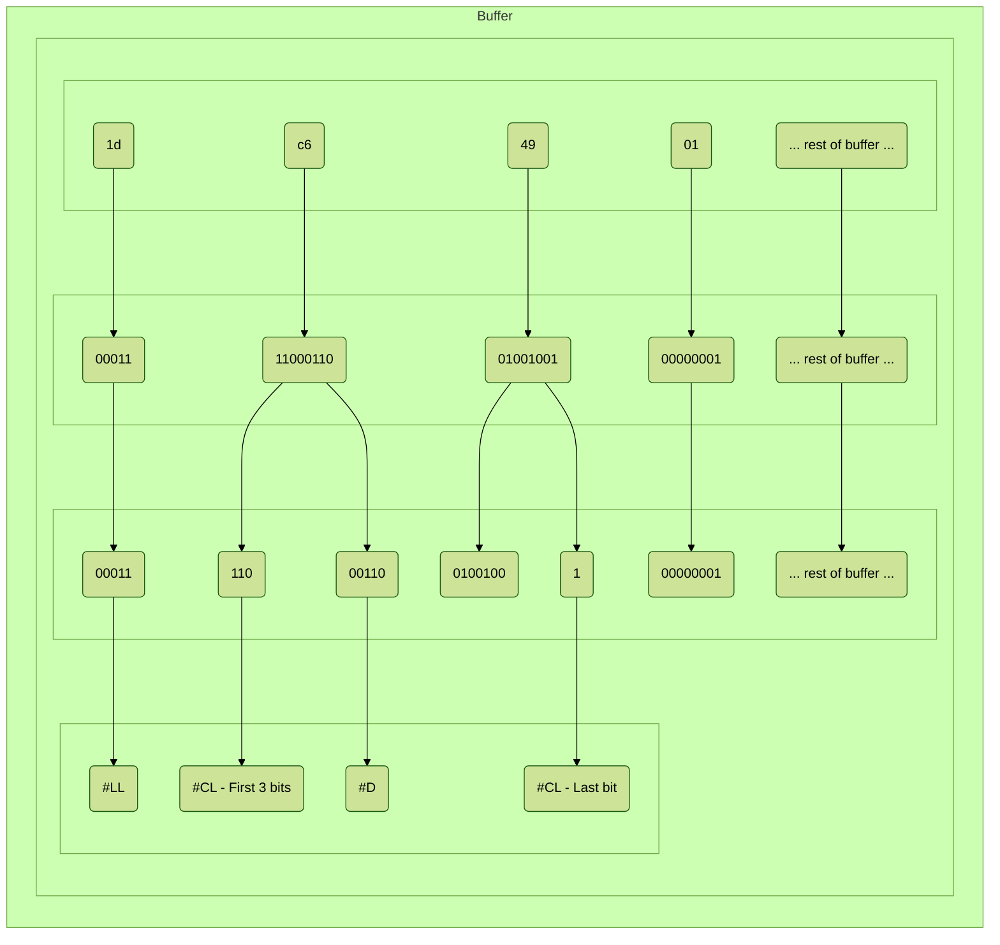
```mermaid
%%{init: { 'theme':'forest' } }%%
graph
    subgraph "Buffer"
    direction TB
        subgraph " "
            direction TB
            subgraph " "
                A(1d)
                B(c6)
                C(49)
                D(01)
                E("... rest of buffer ...")
            end
            subgraph " "
                AB(00011)
                BB(110)
                BBB(00110)
                CB(0100100)
                CBB(1)
                DB(00000001)
                EB("... rest of buffer ...")
            end
            subgraph " "
                ABF(00011)
                BBF(11000110)
                CBF(01001001)
                DBF(00000001)
                EBF("... rest of buffer ...")
            end
            subgraph " "
                ALL("#LL")
                ACLA("#CL - First 3 bits")
                AD("#D")
                ACLB("#CL - Last bit")
            end
           
            A --> ABF
            B --> BBF
            C --> CBF
            D --> DBF
            E --> EBF
            ABF --> AB
            BBF --> BB
            BBF --> BBB
            CBF --> CB
            CBF --> CBB
            DBF --> DB
            EBF --> EB
            AB --> ALL
            BB --> ACLA
            BBB --> AD
            CBB --> ACLB
        end        
    end
```

| Alphabet | Bits |Optional Lengths|Mandatory lengths|Total lengths |
| - | - | - | - | - |
| LL(HLIT) | `00011` | 3 | 257 | 260 |
| D(HDIST) | `00110` | 6 | 1 | 7 |
| CL(HCLEN) | `1110` | 14 | 4 | 18 |

Now that we have the number of code lengths for each alphabet we can start parsing the CL alphabet code lengths. Each code length for the CL alphabet is represented with 3 bits and we need to parse 18 of them (in the order I've indicated previously).

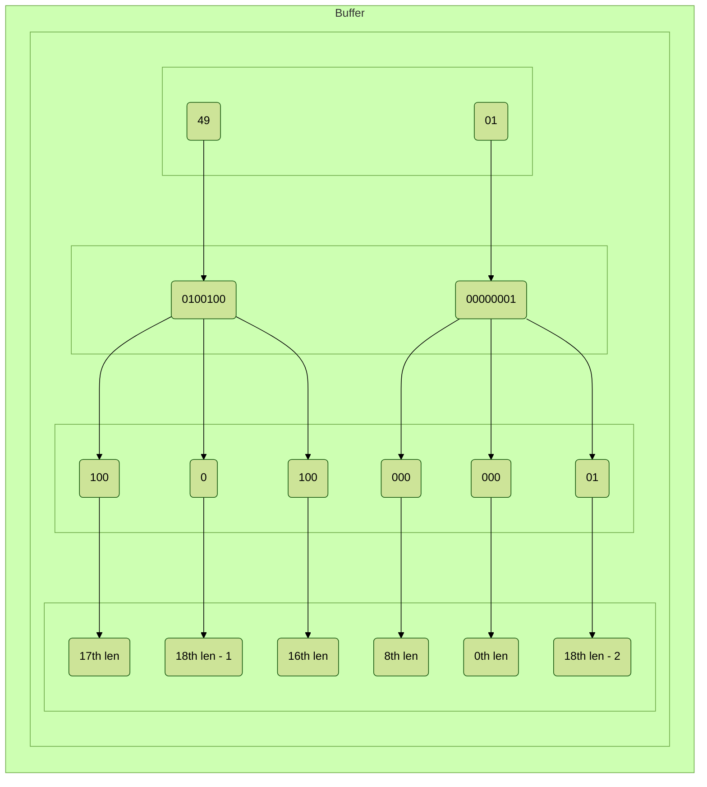
```mermaid
%%{init: { 'theme':'forest' } }%%
graph
    subgraph "Buffer"
    direction TB
        subgraph " "
            direction TB
            subgraph " "
                C(49)
                D(01)
            end
            subgraph " "
                CBF(0100100)
                DBF(00000001)
            end
            subgraph " "
                CB(0)
                CBB(100)
                CBBB(100)
                DB(000)
                DBB(000)
                DBBB(01)
            end
            subgraph " "
                CLB("17th len")
                CLA("16th len")
                CLCA("18th len - 1")
                CLCB("18th len - 2")
                CLD("0th len")
                CLE("8th len")
            end
           
            C --> CBF
            D --> DBF
            CBF --> CB
            CBF --> CBB
            CBF --> CBBB
            DBF --> DB
            DBF --> DBB
            DBF --> DBBB
            CB --> CLCA
            CBB --> CLB
            CBBB --> CLA
            DB --> CLE
            DBB --> CLD
            DBBB --> CLCB
        end        
    end
```


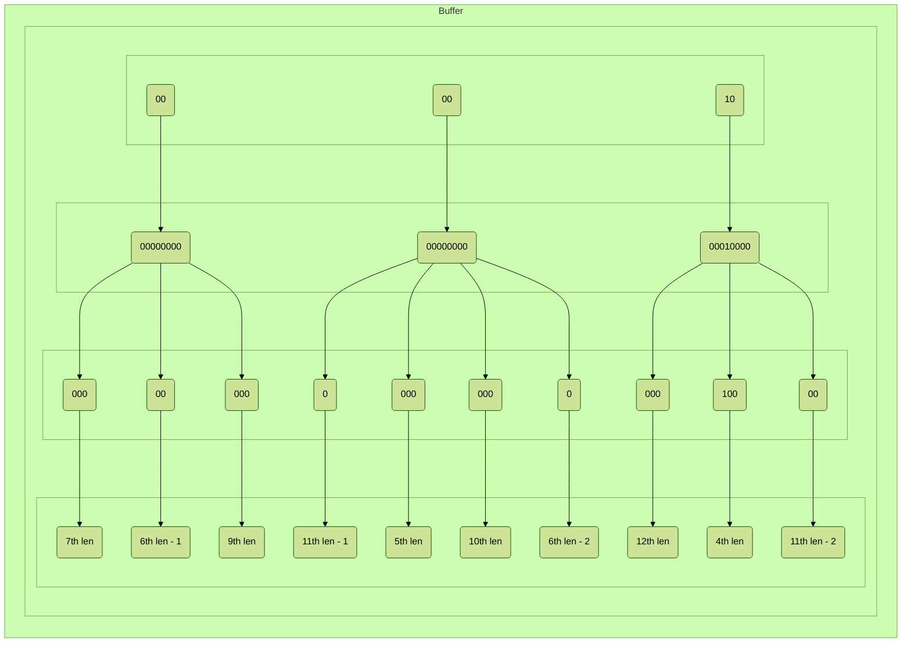
```mermaid
%%{init: { 'theme':'forest' } }%%
graph
    subgraph "Buffer"
    direction TB
        subgraph " "
            direction TB
            subgraph " "
                E(00)
                F(00)
                G(10)
            end
            subgraph " "
                EBF(00000000)
                FBF(00000000)
                GBF(00010000)
            end
            subgraph " "
                EB(00)
                EBB(000)
                EBBB(000)
                FB(0)
                FBB(000)
                FBBB(000)
                FBBBB(0)
                GB(000)
                GBB(100)
                GBBB(00)
            end
            subgraph " "
                CLF("7th len")
                CLG("9th len")
                CLHA("6th len - 1")
                CLHB("6th len - 2")
                CLI("10th len")
                CLJ("5th len")
                CLKA("11th len - 1")
                CLKB("11th len - 2")
                CLL("4th len")
                CLM("12th len")
            end

            E --> EBF
            F --> FBF
            G --> GBF
            EBF --> EB
            EBF --> EBB
            EBF --> EBBB
            FBF --> FB
            FBF --> FBB
            FBF --> FBBB
            FBF --> FBBBB
            GBF --> GB
            GBF --> GBB
            GBF --> GBBB
            EB --> CLHA
            EBB --> CLG
            EBBB --> CLF
            FB --> CLKA
            FBB --> CLJ
            FBBB --> CLI
            FBBBB --> CLHB
            GB --> CLM
            GBB --> CLL
            GBBB --> CLKB
        end        
    end
```

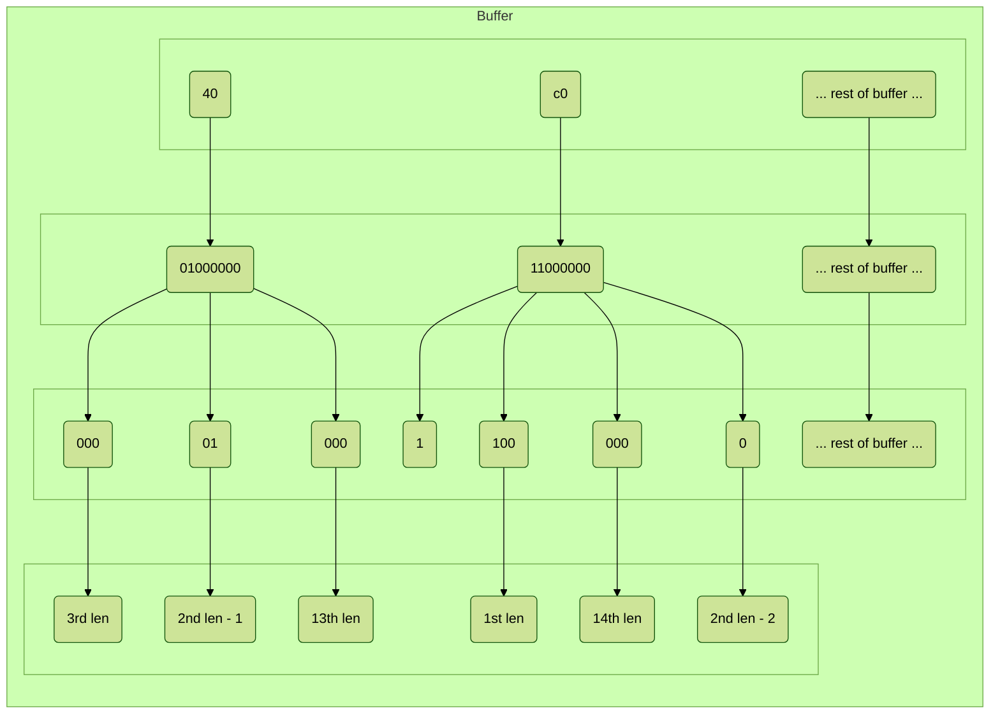
```mermaid
%%{init: { 'theme':'forest' } }%%
graph
    subgraph "Buffer"
    direction TB
        subgraph " "
            H(40)
            I(c0)
            M("... rest of buffer ...")
        end
        subgraph " "
            HBF(01000000)
            IBF(11000000)
            MBF("... rest of buffer ...")
        end
        subgraph " "
            HB(01)
            HBB(000)
            HBBB(000)
            IB(1)
            IBB(100)
            IBBB(000)
            IBBBB(0)
            MB("... rest of buffer ...")
        end
        subgraph " "
            CLN("3rd len")
            CLO("13th len")
            CLPA("2nd len - 1")
            CLPB("2nd len - 2")
            CLQ("14th len")
            CLR("1st len")
        end

        H --> HBF
        I --> IBF
        M --> MBF
        HBF --> HB
        HBF --> HBB
        HBF --> HBBB
        IBF --> IB
        IBF --> IBB
        IBF --> IBBB
        IBF --> IBBBB
        MBF --> MB
        HB --> CLPA
        HBB --> CLO
        HBBB --> CLN
        IBB --> CLR
        IBBB --> CLQ
        IBBBB --> CLPB
    end
```

As you can see we did not parse the code length for the code with value 15. This is because this is a code length of 0 that happens after the last non-zero code length so it was omitted from the stream.

| Value | Bits | Code len | | Value | Bits | Code len |
|     - |    - |        - |-|     - |    - |        - |
| 0  | `000` | `0` | | 10 | `000` | `0` |
| 1  | `100` | `4` | | 11 | `000` | `0` |
| 2  | `001` | `1` | | 12 | `000` | `0` |
| 3  | `000` | `0` | | 13 | `000` | `0` |
| 4  | `100` | `4` | | 14 | `000` | `0` |
| 5  | `000` | `0` | | 15 | not in stream | not in stream (`0`) |
| 6  | `000` | `0` | | 16 | `100`  | `4` |
| 7  | `000` | `0` | | 17 | `100` | `4` |
| 8  | `000` | `0` | | 18 | `010` | `2` |
| 9  | `000` | `0` |

With the code lengths for the CL codes, we can now generate the actual codes. The algorithm we will follow is described below with pseudocode. Ill provide an actual implementation in the last section as I dont want to focus on implementation details for now.

```
class node:
  int value
  node left
  node right
 
root = node()
parsed_code_lengths = [0, 4, 1, 0, 4, 0, 0, 0, 0, 0, 0, 0, 0, 0, 0, 0, 4, 4, 2]

# The array is of fixed size
# CL - CL lengths are at most 7 (3 bits)
# LL and D are at most 15
# total array size will be 15 + 1 or 7 + 1
code_length_counts = [0, 0, 0, 0, 0, 0, 0, 0]

# count codes for each length
for len in parsed_code_lengths:
    code_length_counts[len] += 1

# code_length_counts at this point will be [0, 1, 1, 0, 4, 0, 0, 0]
   
# generate base codes for each length
# base_codes array will have the same size as code_length_counts
code = 0
base_codes = [0, 0, 0, 0, 0, 0, 0, 0]
code_length_counts[0] = 0
for i in range(1,8):
    code = (code + code_length_counts[i - 1]) << 1
    base_codes[i] = code

# base_codes at this point will be [0, 0, 2, 6, 12, 32, 64, 128]
# the values 6, 32, 64 and 128 are garbage as we do not have code lengths of the corresponding size.

# give each value a code based on the base codes
for i in range(0,19) # <--- these are the values of the code length alphabet
    len = parsed_code_lengths[i]
    if len == 0
        continue
       
    current = root
    code = base_codes[len]
    base_codes[len] += 1
   
    while (len > 0)
       
        if (1 << (len - 1) && code)
            if (current.right == NULL)
                current.right = node()
            current = right
        else
            if (current.left == NULL)
                current.left = node()
            current = left
           
        len -= 1

    current.value = i
```

With the above algorithm completed, this is what our tree looks like.

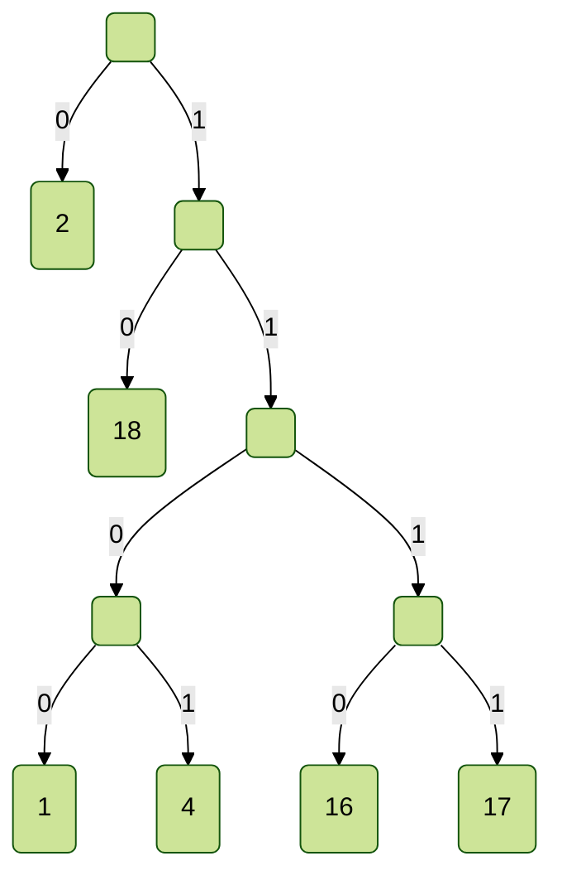
```mermaid
%%{init: { 'theme':'forest' } }%%
graph
    A(" ")
    B(2)
    C(18)
    D(1)
    E(4)
    F(16)
    G(17)
    A --> |0|B
    A --> |1|AA(" ")
    AA --> |0|C
    AA --> |1|AAA(" ")
    AAA --> |0|AAAA(" ")
    AAA --> |1|AAAAA(" ")
    AAAA --> |0|D
    AAAA --> |1|E
    AAAAA --> |0|F
    AAAAA --> |1|G
```

As you can see the values of the alphabet are only at the leaf nodes. Here is the tree in table format

|Value|Code|Code Len|
|-|-|-|
|1|`1100`|`4`|
|2|`0`|`1`|
|4|`1101`|`4`|
|16|`1110`|`4`|
|17|`1111`|`4`|
|18|`10`|`2`|

With the CL alphabet in place we can start parsing the lengths of the LL and D alphabets. We need to parse 260 lengths for the LL alphabet and then 7 lengths for the D alphabet. The idea is to parse a single bit and look it up in the tree, then repeat the same process until we reach a leaf node. 

The first code we parse is 18 (`10`). This code means we have to repeat `0` length X number of times. X is equal to 11 + 7bit int (LSB order). The 7bit integer is 86(`1010110`) so the total number of repetitions is 97(11 + 86). This means that the first 97 entries in the LL alphabet have code length of 0. 

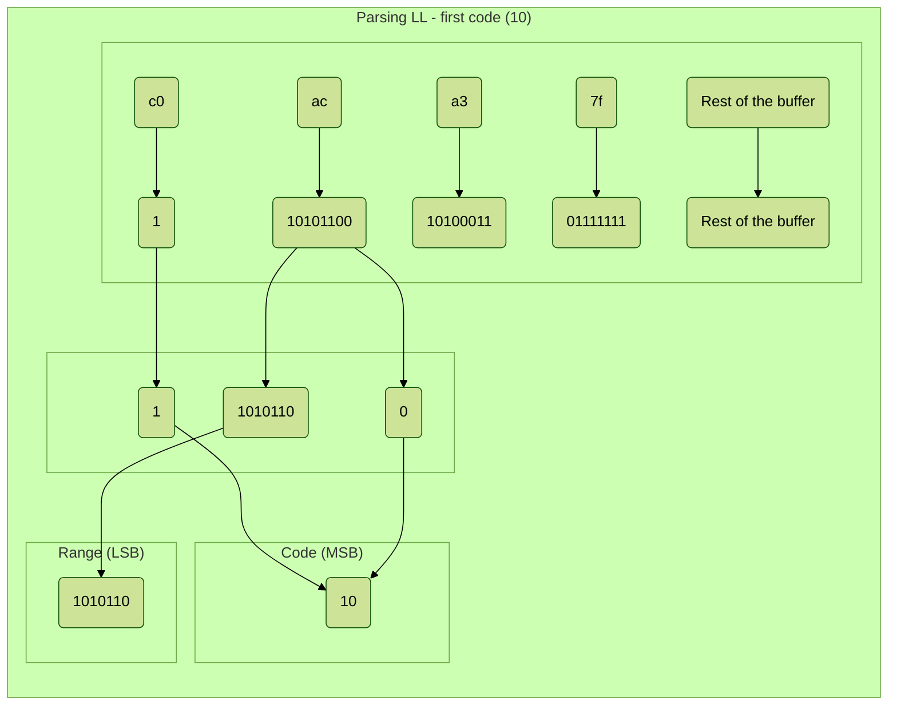
```mermaid
%%{init: { 'theme':'forest' } }%%
graph
    subgraph "Parsing LL - first code (10)"
        direction TB
        subgraph " "
            direction TB
            I(c0)
            J(ac)
            K(a3)
            L(7f)
            M("Rest of the buffer")
            IBF(1)
            JBF(10101100)
            KBF(10100011)
            LBF(01111111)
            MBF("Rest of the buffer")
        end
        subgraph " "
            IB(1)
            JB(1010110)
            JBB(0)
        end
        subgraph "Code (MSB)"
            CA(10)
        end
        subgraph "Range (LSB)"
            RA(1010110)
        end

        I --> IBF
        J --> JBF
        K --> KBF
        L --> LBF
        M --> MBF

        IBF --> IB
        JBF --> JB
        JBF --> JBB

        IB --> CA
        JB ~~~ CA
        JBB --> CA

        JB --> RA

    end
```

The second code that we parse is 1 (`1100`). This means that the 98th value has a Huffman code with length 1.

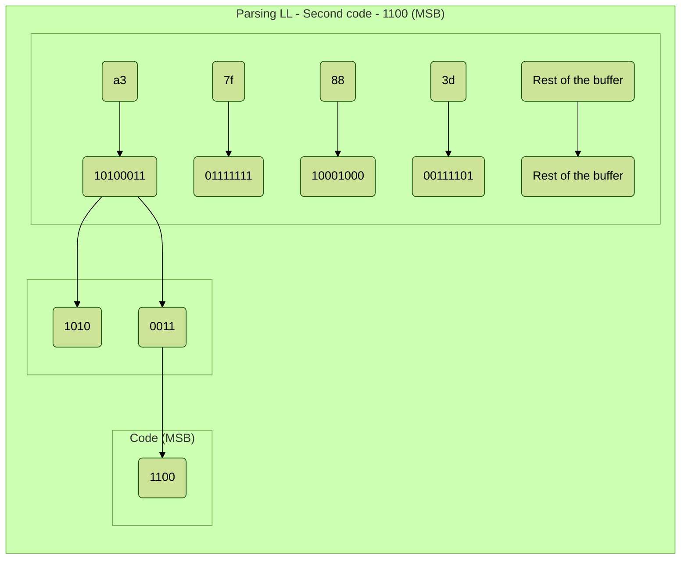
```mermaid
%%{init: { 'theme':'forest' } }%%
graph
    subgraph "Parsing LL - Second code - 1100 (MSB)"
        direction TB
        subgraph " "
            direction TB
            K(a3)
            L(7f)
            M(88)
            N(3d)
            O("Rest of the buffer")
            KBF(10100011)
            LBF(01111111)
            MBF(10001000)
            NBF(00111101)
            OBF("Rest of the buffer")
        end
        subgraph " "
            KB(1010)
            KBB(0011)
        end
        subgraph "Code (MSB)"
            CA(1100)
        end

        K --> KBF
        L --> LBF
        M --> MBF
        N --> NBF
        O --> OBF

        KBF --> KB
        KBF --> KBB

        KBB --> CA
    end
```

The third code that we parse is 2(`0`). This means that the 99th value of LL alphabet has a code length of 2.

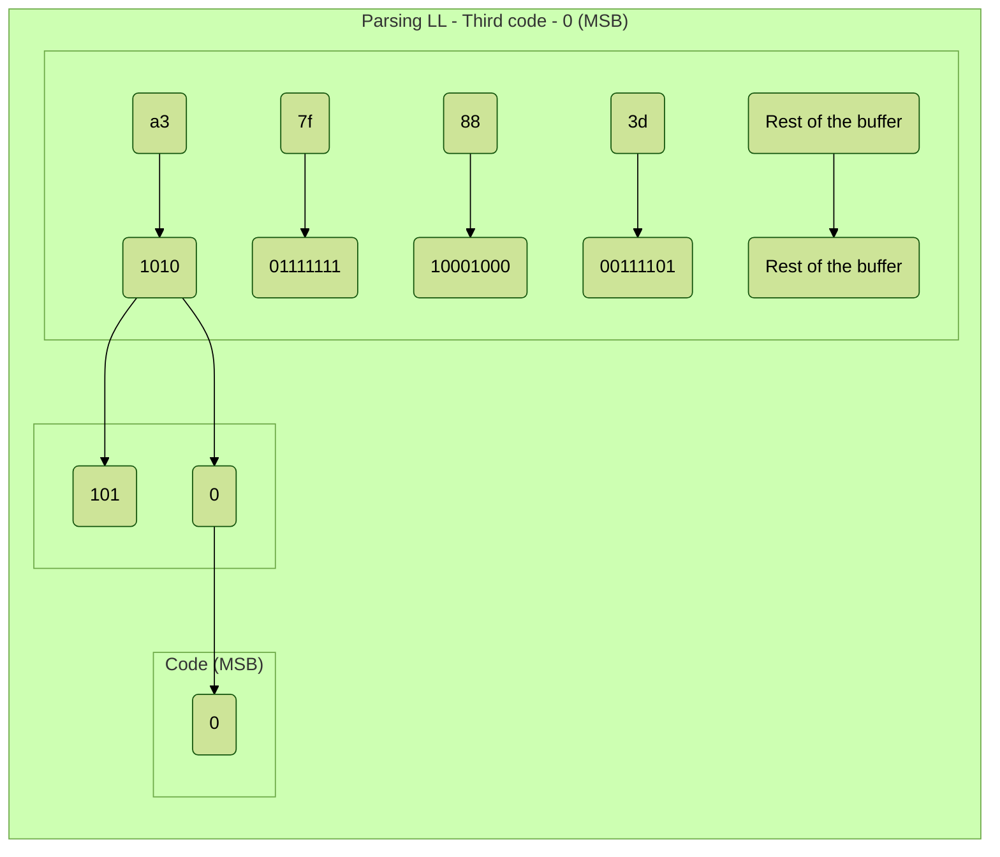
```mermaid
%%{init: { 'theme':'forest' } }%%
graph
    subgraph "Parsing LL - Third code - 0 (MSB)"
        direction TB
        subgraph " "
            direction TB
            K(a3)
            L(7f)
            M(88)
            N(3d)
            O("Rest of the buffer")
            KBF(1010)
            LBF(01111111)
            MBF(10001000)
            NBF(00111101)
            OBF("Rest of the buffer")
        end
        subgraph " "
            KB(101)
            KBB(0)
        end
        subgraph "Code (MSB)"
            CA(0)
        end

        K --> KBF
        L --> LBF
        M --> MBF
        N --> NBF
        O --> OBF

        KBF --> KB
        KBF --> KBB
        KBB --> CA
    end
```

Fourth code is 18 (`10`) so now we have to parse 7 bits to figure out how many times we have to repeat 0. The 7 bits represent 127, so the total number becomes 11 + 127 = 138.

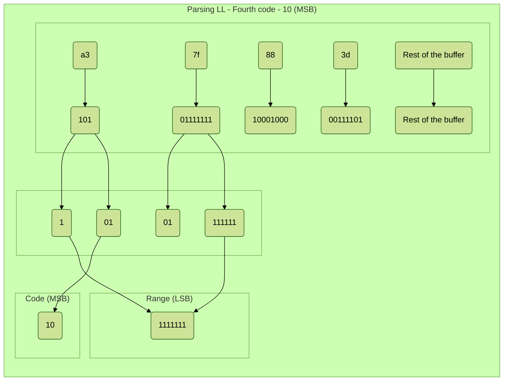
```mermaid
%%{init: { 'theme':'forest' } }%%
graph
    subgraph "Parsing LL - Fourth code - 10 (MSB)"
        direction TB
        subgraph " "
            direction TB
            K(a3)
            L(7f)
            M(88)
            N(3d)
            O("Rest of the buffer")
            KBF(101)
            LBF(01111111)
            MBF(10001000)
            NBF(00111101)
            OBF("Rest of the buffer")
        end
        subgraph " "
            KB(1)
            KBB(01)
            LB(01)
            LBB(111111)
        end
        subgraph "Code (MSB)"
            CA(10)
        end
        subgraph "Range (LSB)"
            RA(1111111)
        end

        K --> KBF
        L --> LBF
        M --> MBF
        N --> NBF
        O --> OBF

        KBF --> KB
        KBF --> KBB
        KB ~~~ CA
        KBB --> CA

        LBF --> LB
        LBF --> LBB
        KB --> RA
        KBB ~~~ RA
        LB ~~~ RA
        LBB --> RA
    end
```

Fifth code is 18 (`10`) again and the 7bit integer is 8 (`0001000`). We have to output 19 lengths of 0.


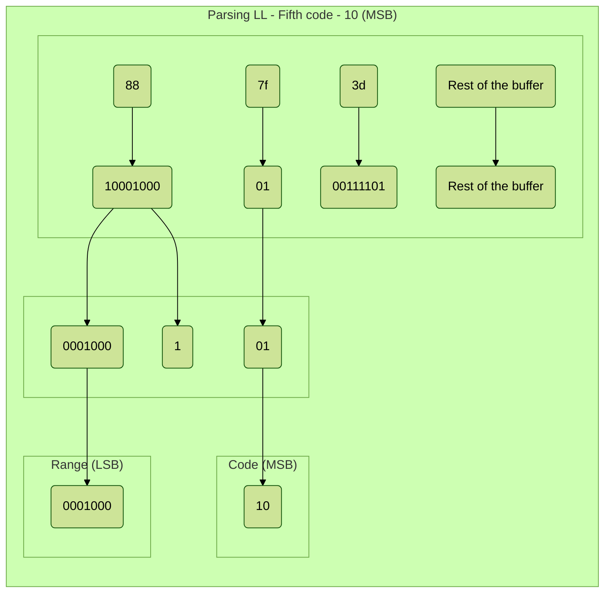
```mermaid
%%{init: { 'theme':'forest' } }%%
graph
    subgraph "Parsing LL - Fifth code - 10 (MSB)"
        direction TB
        subgraph " "
            direction TB
            L(7f)
            M(88)
            N(3d)
            O("Rest of the buffer")
            LBF(01)
            MBF(10001000)
            NBF(00111101)
            OBF("Rest of the buffer")
        end
        subgraph " "
            LB(01)
            MB(1)
            MBB(0001000)
        end
        subgraph "Code (MSB)"
            CA(10)
        end
        subgraph "Range (LSB)"
            RA(0001000)
        end

        L --> LBF
        M --> MBF
        N --> NBF
        O --> OBF

        LBF --> LB
        LB --> CA

        MBF --> MB
        MBF --> MBB
        MBB --> RA

    end
```
We are now at 256 lengths parased for the LL alphabet. The sixth code is 4 (`1101`), so the 257th length is 4.

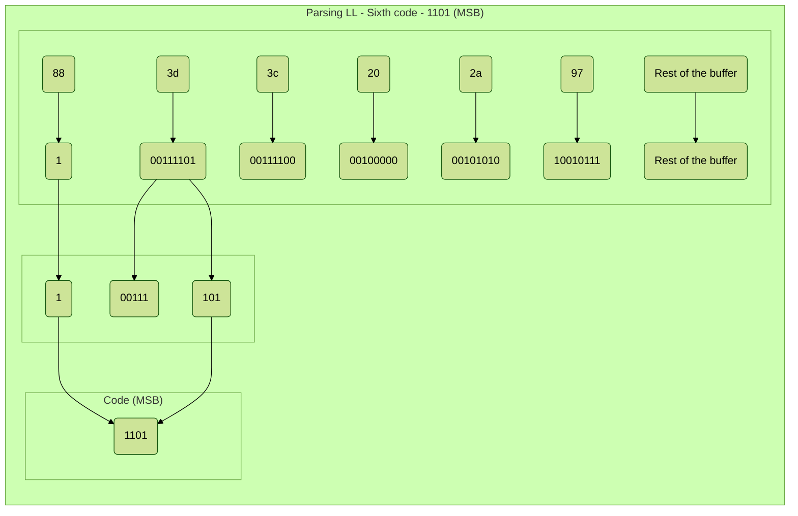
```mermaid
%%{init: { 'theme':'forest' } }%%
graph
    subgraph "Parsing LL - Sixth code - 1101 (MSB)"
        direction TB
        subgraph " "
            direction TB
            M(88)
            N(3d)
            O(3c)
            P(20)
            Q(2a)
            R(97)
            S("Rest of the buffer")
            MBF(1)
            NBF(00111101)
            OBF(00111100)
            PBF(00100000)
            QBF(00101010)
            RBF(10010111)
            SBF("Rest of the buffer")
        end
        subgraph " "
            MB(1)
            NB(00111)
            NBB(101)
        end
        subgraph "Code (MSB)"
            CA(1101)
        end

        M --> MBF
        N --> NBF
        O --> OBF
        P --> PBF
        Q --> QBF
        R --> RBF
        S --> SBF

        MBF --> MB
        NBF --> NB
        NBF --> NBB

        MB --> CA
        NB ~~~ CA
        NBB --> CA
    end
    
```

The seventh code 16(`1110`), so we have to copy the previous code length (4) X number of times where X = 3 + 2bit int (LSB). The 2 bit int is 0(`00`).

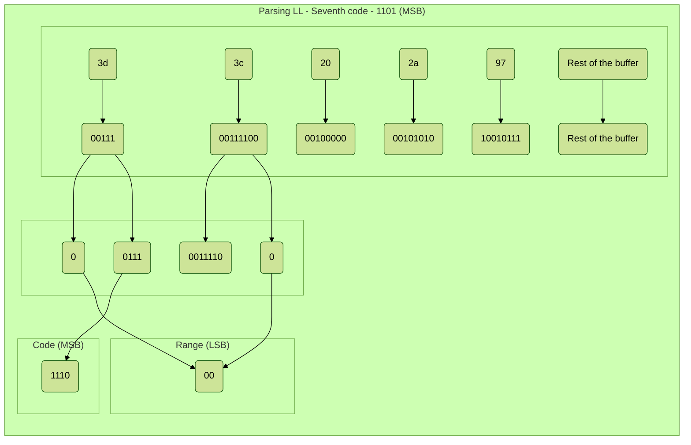
```mermaid
%%{init: { 'theme':'forest' } }%%
graph
    subgraph "Parsing LL - Seventh code - 1101 (MSB)"
        direction TB
        subgraph " "
            direction TB
            N(3d)
            O(3c)
            P(20)
            Q(2a)
            R(97)
            S("Rest of the buffer")
            NBF(00111)
            OBF(00111100)
            PBF(00100000)
            QBF(00101010)
            RBF(10010111)
            SBF("Rest of the buffer")
        end
        subgraph " "
            NB(0)
            NBB(0111)
            OB(0011110)
            OBB(0)
        end
        subgraph "Code (MSB)"
            CA(1110)
        end
        subgraph "Range (LSB)"
            RA(00)
        end

        N --> NBF
        O --> OBF
        P --> PBF
        Q --> QBF
        R --> RBF
        S --> SBF

        NBF --> NB
        NBF --> NBB
        OBF --> OB
        OBF --> OBB

        NB ~~~ CA
        NBB --> CA

        NB --> RA
        NBB ~~~ RA
        OB ~~~ RA
        OBB --> RA
    end
```

At this point we have parsed the code lengths for the LL alphabet and we have the following

```mermaid
%%{init: { 'theme':'forest' } }%%

```


